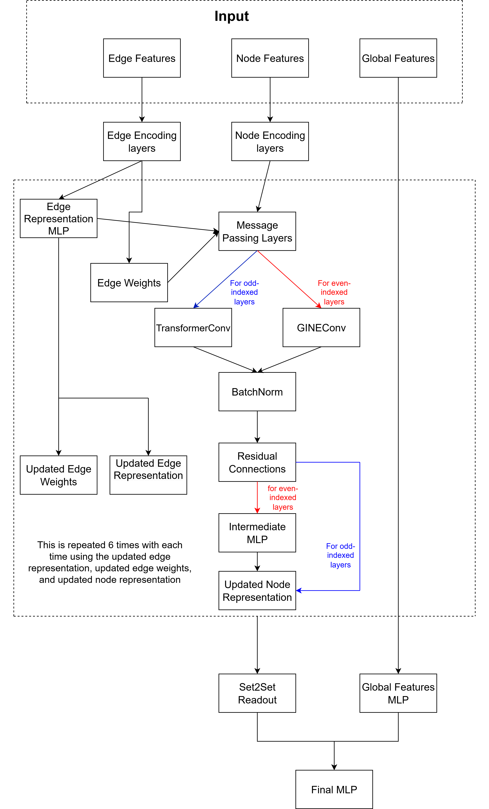
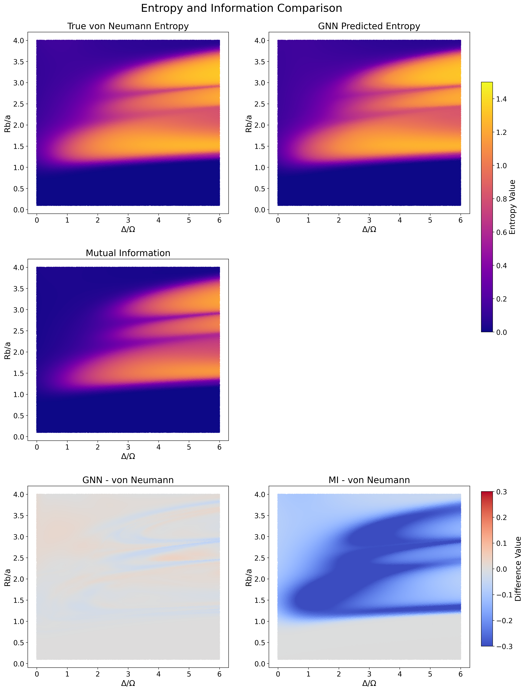
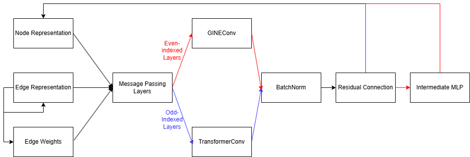

# Predicting von Neumann Entanglement Entropy with Graph Neural Networks

**Predicting von Neumann entanglement entropy directly from experimental bitstrings of Rydberg atom arrays using a physics-informed graph neural network.**

*Figure: Hybrid GNN architecture with alternating message-passing layers and edge-aware attention mechanisms.*

## 📌 Publication

> **Saleh, A. (2025).** Predicting the von Neumann entanglement entropy using a graph neural network. *Machine Learning: Science and Technology*, 6(3), 035034.  
> DOI: [10.1088/2632-2153/adf811](https://doi.org/10.1088/2632-2153/adf811)

This work demonstrates that graph neural networks can predict entanglement entropy directly from experimental measurement outcomes (bitstrings) of Rydberg atom quantum simulators—**without requiring full quantum state tomography**.

## 🔬 Key Results

| Metric | Performance |
|--------|-------------|
| **Mean Absolute Error** (within training range) | 3.6 × 10⁻³ nats |
| **Mean Absolute Percentage Error** | 1.44% |
| **Improvement over classical MI** | 96.6% reduction in MAE (0.103 → 0.0035) |
| **System sizes** | Trained: N=2–12 sites (1–6 rungs) Fine-tuned: N=14–16 sites (7–8 rungs) Tested up to: N=20 sites (10 rungs) |
| **Dataset size** | 1.24 million samples across system sizes |

*Figure: Predicted vs. actual von Neumann entropy across system size (N=12).*

## 🧠 Model Architecture

Our hybrid GNN architecture incorporates quantum physics principles through geometric and correlation-aware features:

### Graph Representation
- **Nodes**: Rydberg atoms with features `[x, y, rydberg_prob, subsystem_mask]`
- **Edges**: Fully connected with features `[normalized_distance, angle, connected_correlation]`
- **Global features**: Subsystem size ratios `[nA/N, nB/N]`

### Core Components
1. **Node/Edge Encoders**: 2-layer MLPs projecting inputs to 512-dimensional hidden space
2. **Edge Attention**: Per-layer MLP producing learnable edge weights (0–1 range via sigmoid)
3. **Hybrid Message Passing** (6 layers):
   - *Even layers*: GINEConv with edge-enhanced message passing
   - *Odd layers*: TransformerConv with 8-head attention and edge conditioning
   - Residual connections after each layer for stable training
4. **Multi-Head Readout**: Dual Set2Set modules (4 processing steps each) → dimensionality reduction
5. **Final Prediction**: MLP combining readout + global features → Softplus activation (enforces S ≥ 0)

*Figure: Message-passing flow with alternating GINEConv (red) and TransformerConv (blue) layers.*

## 🚀 Usage Workflow

The files in this repository are 
1) Data_Generating.py: generates a data set for training
2) pre_processing.py: Converts raw data to graphs ready for GNN training
3) model.py: Contains the GNN model architecture
4) Training.py: Basic training of the model
5) Fine_tuning.py: Fine-tuning the model for larger systems
6) config files: configurations for all the previous files are present
7) best_model_rung1_6.pth and finetuned_model.pth: the weights for the best models. For more information, please refer to the published work DOI: 10.1088/2632-2153/adf811
